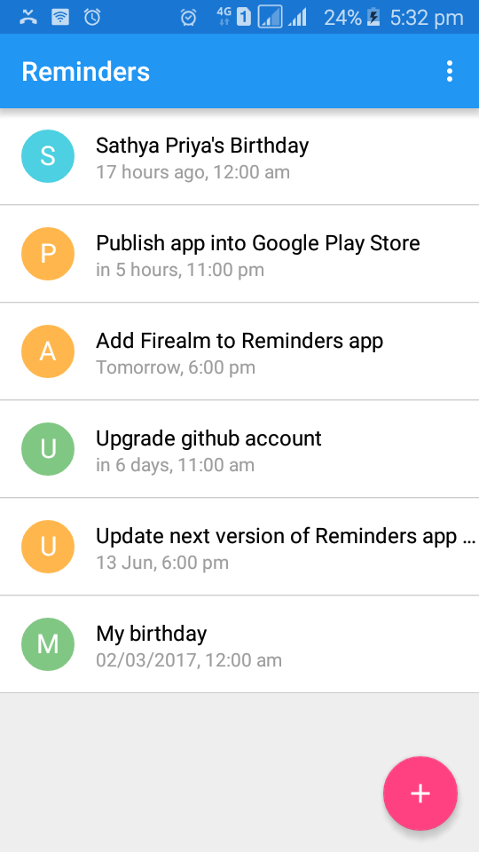
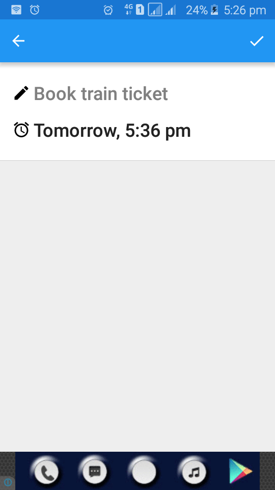
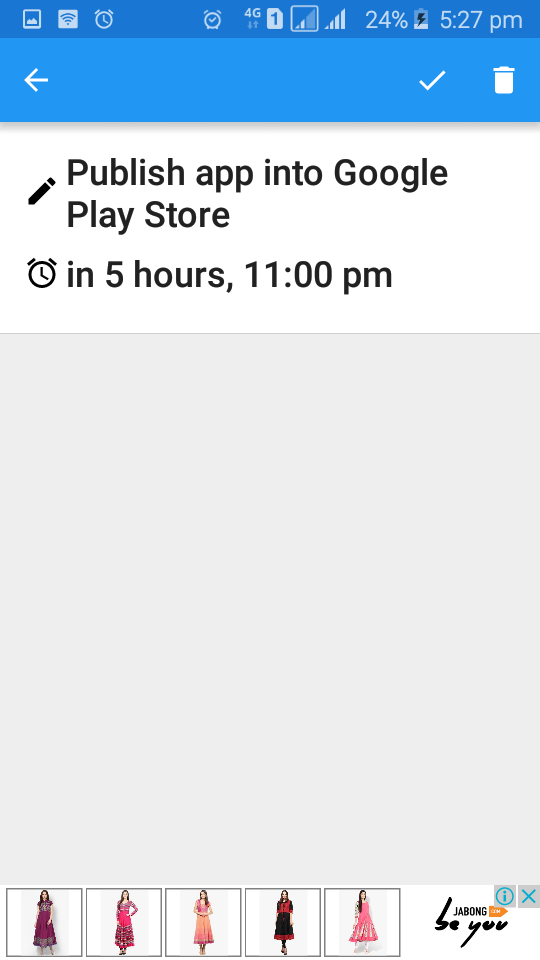
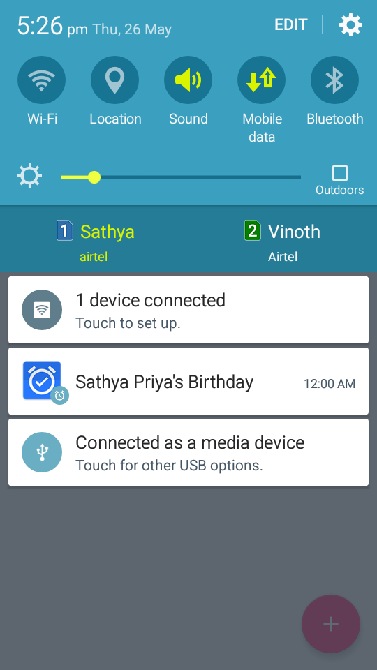

# Vinkas Reminders for Android

Simple App to remind to-do tasks using [Firealm](https://github.com/vinkas-com/firealm-android) (Firebase and Realm)

## Requirements
* [Android Library](https://github.com/vinkas-technologies/android-library)

## Implementations
* Firebase Database
* Firebase RemoteConfig
* Google Mobile Ads
* Material Design

### Screenshots

### Icons
* [Launcher Icon](https://romannurik.github.io/AndroidAssetStudio/icons-launcher.html#foreground.type=clipart&foreground.space.trim=0&foreground.space.pad=0.05&foreground.clipart=res%2Fclipart%2Ficons%2Faction_alarm_on.svg&foreColor=fff%2C0&crop=0&backgroundShape=square&backColor=2979ff%2C100&effects=score) is generated using [Android Asset Studio](https://github.com/romannurik/AndroidAssetStudio) 

